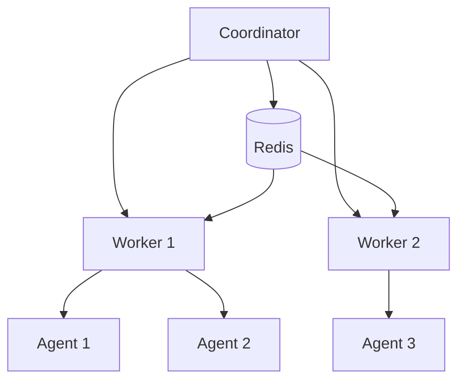

# Agent Coordinator System

A distributed system for coordinating AI agents using AgentLite, designed to run on Heroku with CPU-optimized ML processing.

## Table of Contents
- [Features](#features)
- [System Architecture](#system-architecture)
- [Local Development](#local-development)
- [Deployment](#deployment)
  - [Heroku Deployment](#heroku-deployment)
  - [Docker Deployment](#docker-deployment)
- [Configuration](#configuration)
- [Usage](#usage)
- [Monitoring](#monitoring)
- [Troubleshooting](#troubleshooting)

## Features

- **Distributed Task Processing**: Coordinate multiple agents across worker processes
- **CPU-Optimized**: Designed for CPU-only environments like Heroku
- **Flexible Agent Integration**: Easy integration with existing AgentLite agents
- **State Management**: Redis-based state synchronization
- **Health Monitoring**: Comprehensive system health tracking
- **Metrics Collection**: Prometheus integration for metrics

## System Architecture



## Local Development

### Prerequisites

- Python 3.8+
- Redis server
- virtualenv or conda

### Setup

1. Clone the repository:
```bash
git clone https://github.com/yourusername/agent-coordinator.git
cd agent-coordinator
```

2. Create and activate virtual environment:
```bash
python -m venv venv
source venv/bin/activate  # Linux/Mac
# or
.\venv\Scripts\activate  # Windows
```

3. Install dependencies:
```bash
pip install -e ".[dev]"
```

4. Set up environment variables:
```bash
cp .env.example .env
# Edit .env with your configuration
```

5. Start Redis:
```bash
docker run --name redis -p 6379:6379 -d redis:alpine
# or use your local Redis installation
```

6. Run development server:
```bash
python -m coordinator.core.coordinator
```

### Running Tests

```bash
# Run all tests
pytest

# Run with coverage
pytest --cov=coordinator tests/

# Run specific test file
pytest tests/test_worker.py
```

## Deployment

### Heroku Deployment

1. Install Heroku CLI:
```bash
# macOS
brew tap heroku/brew && brew install heroku

# Linux
curl https://cli-assets.heroku.com/install.sh | sh

# Windows
# Download installer from Heroku website
```

2. Login to Heroku:
```bash
heroku login
```

3. Create Heroku apps:
```bash
# Create coordinator app
heroku create your-coordinator-app

# Create worker app
heroku create your-worker-app

# Add Redis
heroku addons:create heroku-redis:premium-0 --app your-coordinator-app
```

4. Configure apps:
```bash
# Set environment variables
heroku config:set ENVIRONMENT=production --app your-coordinator-app
heroku config:set REDIS_URL=$(heroku config:get REDIS_URL --app your-coordinator-app) --app your-worker-app

# Additional configuration
heroku config:set MAX_WORKERS=2 --app your-worker-app
heroku config:set WORKER_CONCURRENCY=2 --app your-worker-app
```

5. Deploy:
```bash
# Deploy coordinator
git push heroku main:main --app your-coordinator-app

# Deploy worker
git push heroku main:main --app your-worker-app
```

6. Scale workers:
```bash
heroku ps:scale worker=2 --app your-worker-app
```

### Important Heroku Configuration

#### Procfile
```
coordinator: python -m coordinator.core.coordinator
worker: python -m coordinator.workers.worker
```

#### Resource Configuration

- **Coordinator**: Standard-2x dyno recommended
  ```bash
  heroku ps:type standard-2x --app your-coordinator-app
  ```

- **Worker**: Standard-2x dyno recommended for ML tasks
  ```bash
  heroku ps:type standard-2x --app your-worker-app
  ```

#### Memory Management

Monitor memory usage and adjust dyno sizes accordingly:
```bash
heroku metrics:web --app your-coordinator-app
heroku metrics:worker --app your-worker-app
```

## Configuration

### Environment Variables

```env
# Core Settings
ENVIRONMENT=development
MAX_WORKERS=2
WORKER_CONCURRENCY=2

# Redis Configuration
REDIS_HOST=localhost
REDIS_PORT=6379
REDIS_PASSWORD=
REDIS_SSL=False

# Worker Configuration
MAX_CONCURRENT_TASKS=3
TASK_TIMEOUT=300
RETRY_ATTEMPTS=3
RETRY_DELAY=5

# Agent Configuration
DEFAULT_LLM=gpt-4
MAX_TOKENS=2000
TEMPERATURE=0.7
```

### CPU Optimization

The system is configured for CPU-only operation on Heroku:

```python
# TensorFlow CPU Configuration
import tensorflow as tf
tf.config.set_visible_devices([], 'GPU')

# PyTorch CPU Configuration
import torch
torch.set_num_threads(4)
```

## Monitoring

### Health Checks

Access health endpoints:
```bash
# Coordinator health
curl https://your-coordinator-app.herokuapp.com/health

# Worker health
curl https://your-worker-app.herokuapp.com/health
```

### Metrics

Prometheus metrics are available at:
```bash
# Coordinator metrics
curl https://your-coordinator-app.herokuapp.com/metrics

# Worker metrics
curl https://your-worker-app.herokuapp.com/metrics
```

### Logs

View logs:
```bash
# Coordinator logs
heroku logs --tail --app your-coordinator-app

# Worker logs
heroku logs --tail --app your-worker-app
```

## Troubleshooting

### Common Issues

1. **Worker Connection Issues**
   ```bash
   # Check Redis connection
   heroku redis:info --app your-coordinator-app
   
   # Restart workers
   heroku ps:restart worker --app your-worker-app
   ```

2. **Memory Issues**
   ```bash
   # Check memory usage
   heroku ps:metrics --app your-worker-app
   
   # Restart if needed
   heroku ps:restart --app your-worker-app
   ```

3. **Task Processing Issues**
   - Check worker logs
   - Verify Redis connection
   - Check agent configurations

### Support

For issues and support:
1. Check the [Issues](https://github.com/yourusername/agent-coordinator/issues) page
2. Create a new issue with:
   - System configuration
   - Error logs
   - Steps to reproduce

## License

MIT License - see [LICENSE](LICENSE) for details